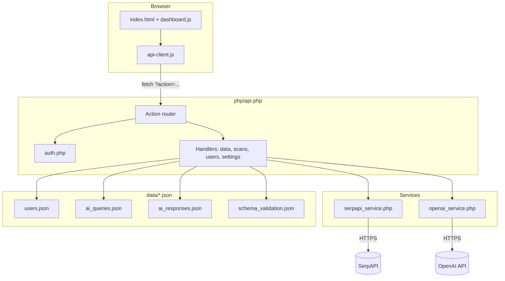

# AI Visibility Dashboard — How It Works

This document describes **what the system does**, **how components interact**, and **the main mechanisms** (authentication, scanning, metrics, and data). For endpoint-level API details, see [TECHNICAL_API_DOCUMENTATION.md](./TECHNICAL_API_DOCUMENTATION.md).

---

## 1. Purpose

The dashboard helps teams **track whether a brand appears** in:

- **Google AI Overviews** (via SerpAPI, which mirrors Google’s AI Overview content for a query and region).
- **ChatGPT-style answers** (via OpenAI’s Chat Completions API, as a proxy for “what a chat model might say” for the same query).

It supports **multiple clients**: admins manage users and assign **tracked queries** per client; clients see only their own queries.

---

## 2. Technology Stack

| Layer | Technology |
|--------|------------|
| Frontend | Static HTML/CSS, vanilla JavaScript (`js/dashboard.js`, `js/api-client.js`), Chart.js, html2pdf, marked |
| Backend | PHP 8+ (`php/api.php` as a single entry router) |
| Storage | JSON files under `data/` (no SQL database) |
| Secrets | `credentials/.env` (API keys, optional Google settings) |
| Optional integrations | Google Search Console & GA4 sync (`php/gsc-sync.php`, `php/ga4-sync.php`) via `composer` + `google-credentials.json` |

---

## 3. Architecture Overview

**Single entry point:** all frontend calls go to `php/api.php?action=<name>`. `php/config.php` sets JSON headers, CORS, timezone (`Asia/Dubai`), and helpers `readJson` / `writeJson` for files in `data/`.

---

## 4. Authentication and Authorization

### Mechanism

- **PHP sessions** (`session_start()` in `config.php`).
- Users live in **`data/users.json`** with **`password_hash`** / **`password_verify`** (bcrypt).
- On login, `auth.php` stores `user_id`, `user_email`, `user_role`, `user_name`, `user_company` in `$_SESSION`.

### Bootstrap admin

- **`ensureAdminAccount()`** in `auth.php` creates a default admin if `users.json` is empty, or fixes a placeholder hash for `u001`. This guarantees a first-time login path.

### Roles

| Role | Behavior |
|------|----------|
| **admin** | Sees all AI queries (optionally filtered by client), manages users, API keys, CRUD on queries |
| **client** | Sees only queries where **`client_id` matches their user id** |

**Enforcement:** `requireAuth()` and `requireAdmin()` in `api.php` stop execution with HTTP 401/403 and JSON errors. The scan handler **`run_ai_query_check`** additionally refuses non-admins from checking another client’s query.

---

## 5. Core Data Model (JSON)

| File | Role |
|------|------|
| **`users.json`** | Accounts: `id` (`u001`…), email, hash, `role`, `company`, `status` |
| **`ai_queries.json`** | **Primary operational store** for tracked prompts: query text, `brand_name`, `location`, `client_id`, `status`, `last_checked`, **`latest_result`** (Google + ChatGPT payloads) |
| **`ai_responses.json`** | Historical / demo / **manual scan** rows (`run_scan`), used for legacy-style metrics in docs; not always the same shape as `latest_result` |
| **`schema_validation.json`** | Technical SEO schema checks (exposed via `get_data`) |
| **`prompts.json`, `competitors.json`, `facts.json`, etc.** | Present for demos or older flows; main UI is driven by **`ai_queries.json`** + `get_data` |

**Query IDs:** new queries get ids like `q001`, `q002` by scanning existing `q\d+` ids and incrementing.

---

## 6. The Scanning Pipeline (Main Business Logic)

When a user runs a **check** on a saved query (`action=run_ai_query_check`, body `{ "id": "q..." }`):

1. **Load** the query from `ai_queries.json` and **authorize** (own client or admin).
2. **Read keys** from `credentials/.env`: `SERPAPI_KEY`, `OPENAI_API_KEY`, optional `BRAND_NAME`.
3. **Resolve brand and region:** per-query `brand_name` and `location`, else env default brand and `us`.
4. **Google AI Overview (SerpAPI)** — `scanWithSerpAPI()` in `serpapi_service.php`:
   - **Step A:** Google search via SerpAPI for the prompt and geo (`gl` / location string by region).
   - **Step B:** If the response includes **`ai_overview.serpapi_link`**, fetch that URL (with API key) for full **`text_blocks`** and **`references`**.
   - **Parse** HTML for the UI from `text_blocks` (paragraphs, headings, lists) or `text_content`.
   - **Brand mention:** case-insensitive substring match of the brand in extracted AI text (`stripos`).
   - **Sentiment (rule-based):** if mentioned and text contains “best”, “top”, or “leading” → `positive`; if mentioned otherwise → `neutral`; if not mentioned → `negative`.
   - **Citations:** from `references[]`; domains feed **`competitors_mentioned`** as domains.
   - **Optional LLM enrichment:** if `OPENAI_API_KEY` is set, **`extractMetricsFromText()`** sends the raw AI Overview text to GPT-4o to extract **`position`**, **`description_exact_words`**, **`competitors_before_brand`**, **`omitted_competitors`** (structured JSON). This augments the rule-based block for exports and tables.
5. **ChatGPT proxy (OpenAI)** — `scanPromptWithOpenAI()` in `openai_service.php`:
   - Calls **`gpt-4o`** with **`response_format: json_object`** so the model returns **`response_text`**, **`brand_mentioned`**, **`sentiment`**, plus optional competitive fields in the same schema.
   - **Highlights** the brand in HTML with a styled `` when mentioned.
   - A **second** call to **`extractMetricsFromText`** may run on the ChatGPT HTML (see `api.php`) to align metrics fields with the Google path.
6. **Persist:** merge into **`latest_result`**: `{ timestamp, google: {...}, chatgpt: {...} }`, set **`status`** to `Checked`, **`last_checked`** to now, write `ai_queries.json`.

**Important:** SerpAPI is **required** for checks; OpenAI is **optional** for the ChatGPT half (if missing, that half returns an error object in `latest_result.chatgpt`).

---

## 7. Other API Behaviors

- **`get_data`:** Returns `ai_responses.json`, `schema_validation.json`, and **`aiQueries`** filtered by role (and optional `client_id` for admins). Used to hydrate legacy metrics if wired; the main dashboard also uses **`get_ai_queries`** / **`fetchAiQueries`**.
- **`save_ai_query` / `delete_ai_query`:** Admin-only; mutate `ai_queries.json`.
- **`run_scan`:** Admin-only one-off scan; can append to **`ai_responses.json`** (with a **simulated** path if OpenAI key is missing for non-Google platform).
- **`export`:** CSV export of filtered queries with flattened Google/ChatGPT columns from **`latest_result`**.
- **`get_settings` / `save_settings`:** Masked display of keys; writes `.env` without overwriting keys when the UI sends masked `...` placeholders.

---

## 8. Frontend Logic (`js/dashboard.js`)

- **Boot:** `apiGetSession()` → redirect to `login.html` if not authenticated.
- **Role UI:** toggles `.admin-only` sections and table columns; fills sidebar from session.
- **Data:** loads **`fetchAiQueries`** (and **`apiListUsers`** for admins); **`selectedClientFilter`** syncs dropdowns and refetches.
- **Overview metrics** (no separate `calculations.js` import in `index.html`):
  - Counts queries; for **checked** queries, counts Google vs ChatGPT **`brand_mentioned`**.
  - **Visibility score:** \((\text{google mentions} + \text{chatgpt mentions}) / (2 \times \text{checked count})\) as a percentage, with color thresholds on the progress bar.
- **Tables:** AI Overview vs ChatGPT views are projections of the same **`ai_queries`** list with different columns.
- **Modals:** add query, add client, view **`latest_result`** with tabs for Google vs ChatGPT.
- **Exports:** CSV via API; PDF via hidden template + html2pdf.

---

## 9. Client-Side Metrics Library (`js/calculations.js`)

This file implements **Share of Mention**, **sentiment scoring**, **win/loss**, **competitor gaps**, **citation velocity**, **revenue impact** (GA4-shaped), and **schema score**. It is **documented** as supporting advanced dashboards and operates on **`ai_responses.json`-style** arrays.

**Note:** `index.html` does **not** include `calculations.js`; the live overview uses inline logic in **`dashboard.js`**. The calculations module is available for **demo pages** or future wiring (e.g. if `get_data` responses are passed into these functions).

---

## 10. Optional Google Analytics & Search Console

- **`gsc-sync.php`** / **`ga4-sync.php`** use **`google-credentials.json`** and `.env` (`GSC_SITE_URL`, `GA4_PROPERTY_ID`) to write **`gsc_data.json`** / **`ga4_data.json`**.
- These are **not** invoked from `api.php` in the reviewed router; they are **batch-style** utilities for populating JSON for analysis (e.g. revenue correlation in `calculateRevenueImpact` when GA4-shaped data exists).

---

## 11. Repository Utilities (Non-UI Scripts)

The repo includes **PHP/Python one-off scripts** (e.g. `add_*.php`, `deduplicate_*.php`, `generate_data.py`, `patch_tatras_client_id.py`) for **bulk-importing**, **deduplicating**, or **repairing** `ai_queries.json` / related data. They are operational tools, not part of the browser request path.

---

## 12. Summary Table: Mechanisms vs. Files

| Mechanism | Where it lives |
|-----------|----------------|
| HTTP routing & actions | `php/api.php` |
| Sessions, passwords, roles | `php/auth.php` |
| JSON I/O, CORS, timezone | `php/config.php` |
| Google AI Overview fetch & parse | `php/serpapi_service.php` |
| ChatGPT-style completion + JSON + highlight | `php/openai_service.php` |
| GPT extraction of position/competitors from text | `extractMetricsFromText()` in `php/openai_service.php` |
| Dashboard UI & visibility math | `js/dashboard.js` |
| Fetch wrappers | `js/api-client.js` |
| Advanced metrics (library) | `js/calculations.js` (optional include) |

---

*Generated for the AI Visibility Dashboard codebase. For request/response schemas and curl-style details, use [TECHNICAL_API_DOCUMENTATION.md](./TECHNICAL_API_DOCUMENTATION.md).*
